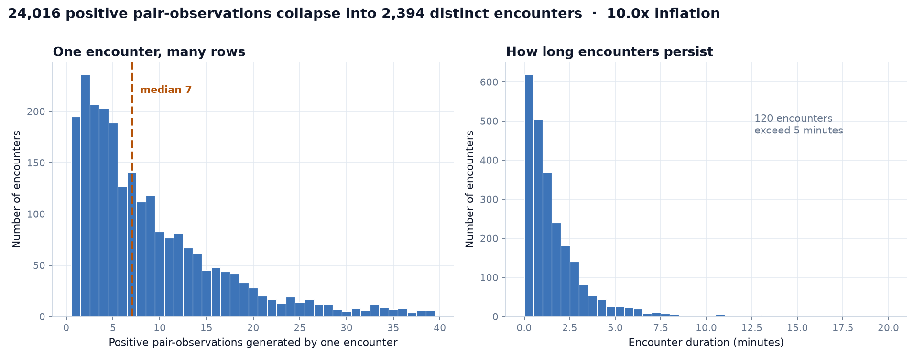
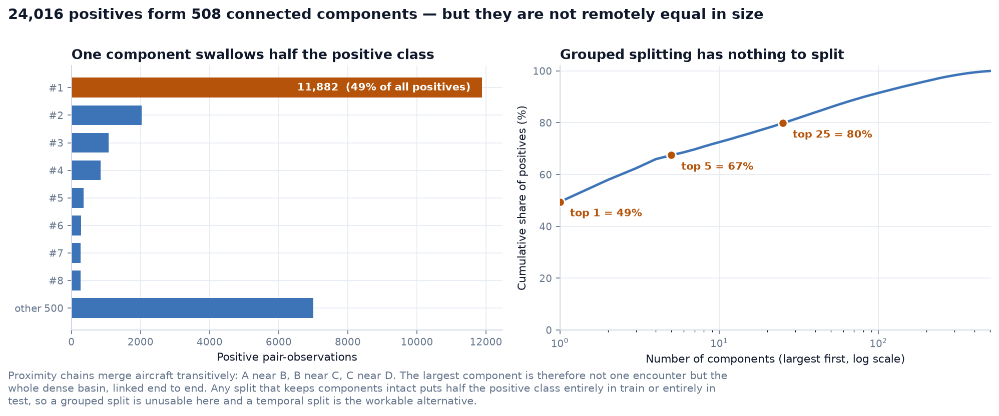
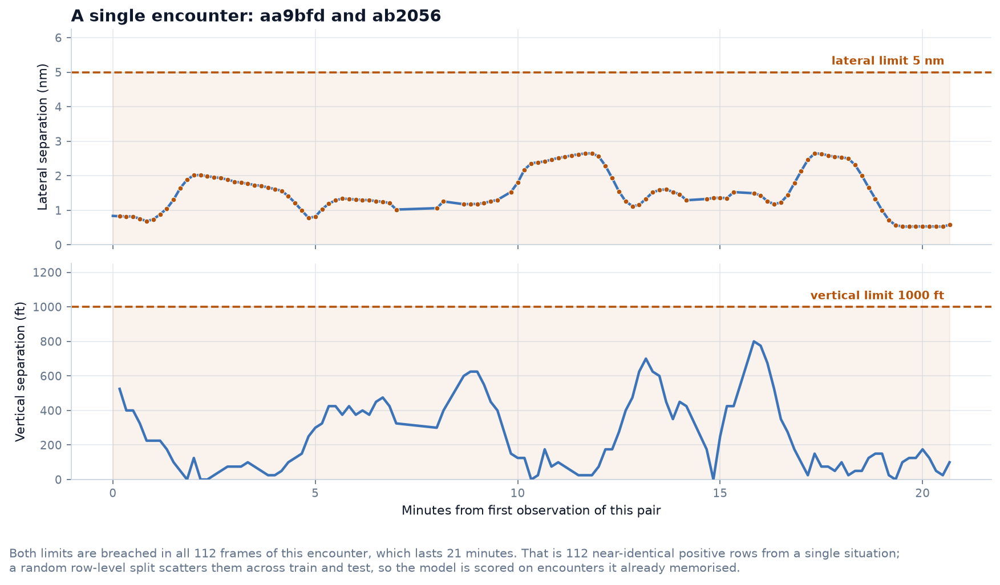
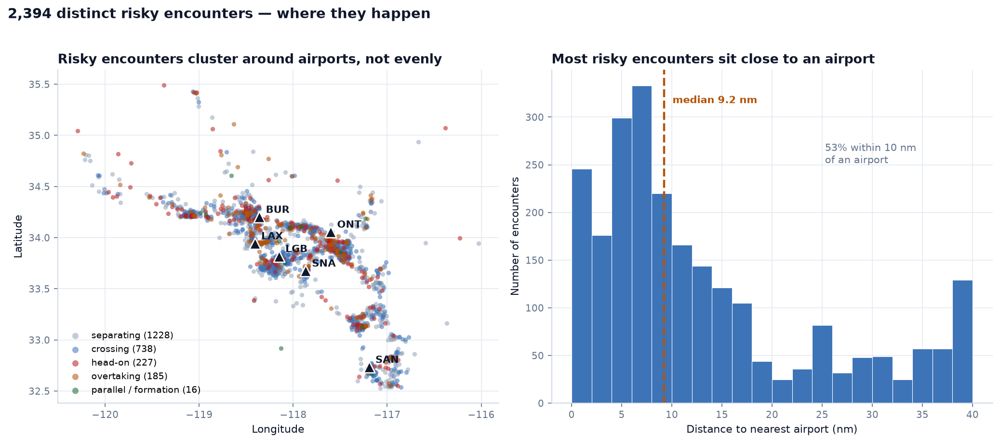
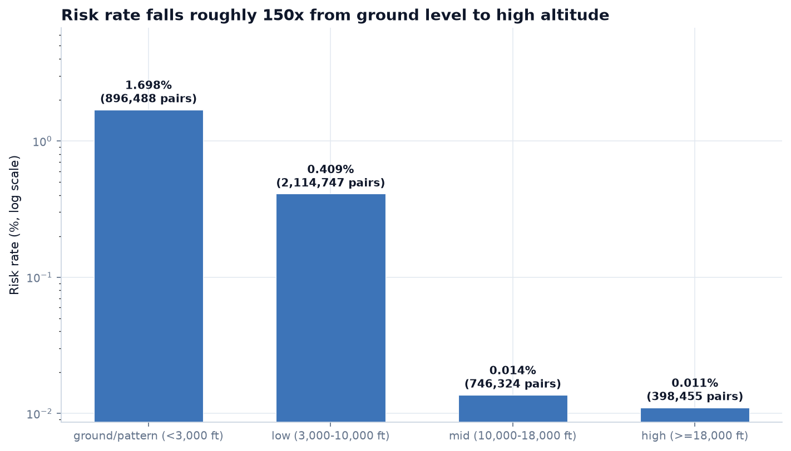
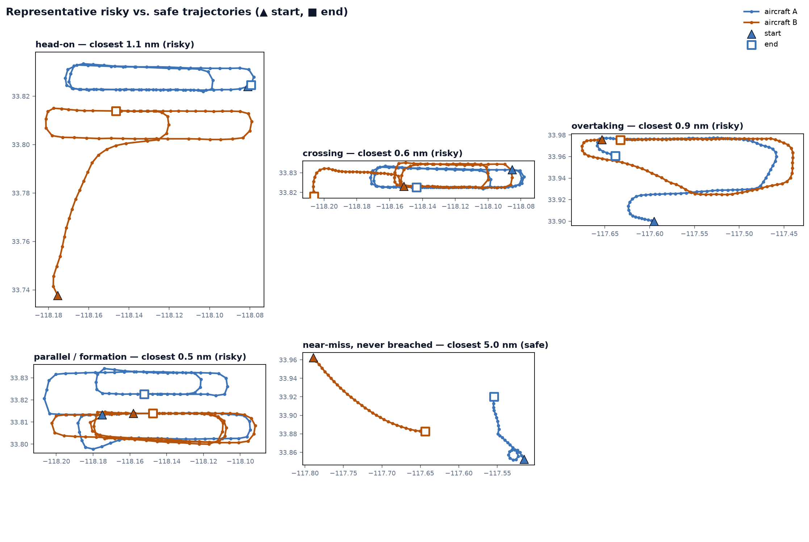
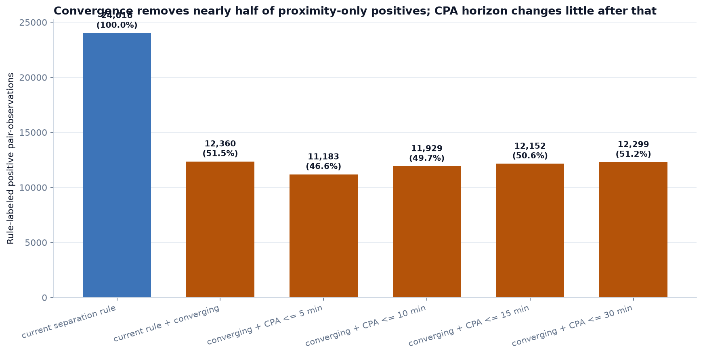

# Airspace Collision Risk Prediction

## Abstract

This project investigates whether machine-learning models can identify potential aircraft-pair collision risk from Automatic Dependent Surveillance-Broadcast (ADS-B) telemetry. The research focuses on Southern California airspace and is designed to compare a graph neural network baseline with a Temporal Fusion Transformer (TFT) once sufficient historical trajectory data has been collected.

The study first examined imbalance-aware classification strategies for the rare collision-risk event, and then extended the workflow to graph-based representations of aircraft interactions. The work in this phase was designed to evaluate how class imbalance affects safety-critical detection and to ensure that the later graph formulation preserves the same collision-risk signals used in the base feature pipeline.
An initial imbalance study used a single snapshot. The project has since added a 58-minute backfill, allowing repeated aircraft-pair observations, encounter duration, trajectory geometry, and candidate label definitions to be examined. These newer analyses are exploratory and use the existing rule-based label; they do not identify confirmed collision events.
## Section I
### Introduction

Mid-air collision prevention is a safety-critical prediction problem with two important characteristics. First, risk belongs to a relationship between two aircraft rather than to one aircraft in isolation. Second, a possible conflict develops over time: distance, altitude, heading, speed, and the projected point of closest approach must be considered together.
This project therefore represents aircraft as interacting entities and creates features for aircraft pairs that are geographically close. The longer-term research goal is to compare two model families:

- A graph neural network (GNN) that represents aircraft as nodes and nearby aircraft pairs as edges.
- A Temporal Fusion Transformer (TFT) that uses sequences of pair features over time.

The imbalance analysis identified the most reliable strategy for a highly skewed collision-risk label, and the subsequent graph formulation translated the same kinematic features into a spatial representation suitable for modeling aircraft interaction patterns.This stage was important because collision-risk prediction is a safety problem, so the model selection process needed to balance recall, precision, and the cost of false negatives rather than relying only on aggregate accuracy.

## Section II
### Related Work

The project builds on a data pipeline that combines ADS-B state information, pairwise feature engineering, and rule-based labeling for collision-risk detection. A structured exploratory analysis was used to assess class imbalance, feature quality, and the suitability of the generated pair features for downstream modeling.

This section reflects the practical work carried out to select a more robust classification strategy and to convert the same pairwise signals into a graph representation that better captures aircraft-to-aircraft interaction.The methodology compared baseline performance under different imbalance-handling strategies to select the most suitable approach for collision-risk detection, and then transformed aircraft snapshots into graphs where nodes represent aircraft and edges encode proximity and interaction features.

## Section III
### Proposed Methodology

#### Dataset description and Preprocessing
The methodology uses ADS-B state-vector data collected from the OpenSky Network for Southern California. The data dictionary records the available fields, units, and known data-quality issues. NTSB accident records were collected separately for background context. A recent authenticated backfill added 349 frames over a 58-minute period; this supports short-window encounter analysis, but it is not a substitute for the longer historical record needed to study different dates and seasons.

##### Feature Engineering
The pipeline converts aircraft observations into pairs within 50 nautical miles. For each pair, it calculates horizontal distance, closing speed, bearing difference, vertical separation, and time to the closest point of approach. Ground aircraft and stale position reports are filtered before pair construction. Under the current rule, a pair is labeled risk when lateral separation is at most 5 nautical miles and vertical separation is at most 1,000 feet. Pair features are built within each snapshot so aircraft are not paired across different times. Further data-quality and multi-day analysis is still needed before drawing general conclusions or evaluating temporal models.

The methodology prioritised imbalance-aware evaluation and then represented aircraft as interacting nodes with edge attributes that reflect distance, closing speed, and time-to-CPA. This setup supports graph-based learning without changing the original modeling foundation already described in the file.The graph construction step was designed to preserve the key collision-risk cues from the pair-feature pipeline while adding the relational structure needed for a graph neural network baseline.
## Section IV
### Results and Discussion

**Backfill data collection.** An authenticated OpenSky backfill collected 349 frames at approximately 10-second spacing across a 58-minute window. The resulting pair-feature dataset contains 4,158,918 pair-observations. This provides a short continuous sample for studying encounters, although it does not cover multiple days or seasons.

**Are the positive observations distinct situations?** The current separation rule labels 24,016 pair-observations as positive, or 0.577% of all pair-observations. Grouping the same aircraft pair into one encounter when positive observations are no more than 60 seconds apart gives 2,394 encounters, approximately 10 positive rows per encounter. The median encounter contains 7 observations and lasts 60 seconds. The longest lasts about 20.5 minutes and contributes 112 positive observations. This shows that positive rows are repeated measurements, not all independent situations.

Connected-component analysis found 508 components. The largest contains 11,882 positive observations (49.5%); the top five contain 67.5%, and the top 25 contain 79.8%. These components can join through chains of aircraft and frames, so they should not be interpreted as individual real-world incidents. They do show why a random row-level train/test split could place related observations in both sets.

This figure shows how many positive rows each encounter contributes and how long those encounters last. Most are short, while a few persistent encounters create many repeated rows.

The largest connected component contains about half of the positives. This is a warning about dependence in the data, not evidence that half the positives belong to one physical event.

This example follows one aircraft pair over its longest positive encounter. It illustrates how a single pair can produce many positive observations while remaining within the current thresholds; it does not establish whether the close flight was intentional or unsafe.

**Geometry and location.** At the observation level, 51.5% of the current positives have non-positive closing speed, meaning the aircraft were not getting closer at that observation. An encounter-level heuristic classified 1,228 encounters as separating, 738 as crossing, 227 as head-on, 185 as overtaking, and 16 as parallel/formation. These are descriptive categories based on median bearing difference and closing speed, not verified operational labels.

Encounter locations cluster around the Los Angeles basin, with a smaller concentration near San Diego. The median distance from an encounter midpoint to the nearest of six selected airports is 9.2 nautical miles; 53.2% are within 10 nautical miles. This map contains positive encounters only, so it does not establish that these locations have higher risk rates than areas with more safe traffic.

This map shows where the positive encounters occurred during this collection window. Its geographic clusters are descriptive; a safe-traffic denominator is needed for regional risk-rate comparisons.

Using all pair-observations as denominators, the current-rule positive rate is 1.70% below 3,000 feet, 0.41% from 3,000 to 10,000 feet, 0.014% from 10,000 to 18,000 feet, and 0.011% at or above 18,000 feet. The higher rate at low altitude may reflect routine traffic patterns as well as the behavior of the current label; this one window cannot establish a general safety relationship.

The rate is highest in the below-3,000-foot band and falls sharply at higher altitudes. The logarithmic vertical axis makes the small high-altitude rates visible.

These selected paths illustrate several movement patterns among positive encounters and one nearby pair that did not meet both current thresholds. They are examples for visual inspection, not a representative sample of every positive or safe pair.

**Step 5 — Label-rule sensitivity.** The current rule produces 24,016 positive observations. Requiring positive closing speed reduces this to 12,360. Adding a time-to-CPA limit of 5, 10, 15, or 30 minutes gives 11,183, 11,929, 12,152, and 12,299 observations. Requiring convergence makes the largest difference in this comparison; changing the tested CPA horizon makes a smaller difference.

This comparison shows how the positive count changes when convergence and a CPA time horizon are added. The candidates do not test predicted separation distance at CPA, so they are not yet complete alternative risk labels. The existing labels remain unchanged pending discussion with the professor.

The earlier single-snapshot dataset contained 8,309 pair rows and 55 positives (0.662%). Its class-distribution, feature-EDA, and logistic-regression imbalance figures are not shown here as current multi-frame results. Those earlier experiments remain historical context; model performance should be revisited using a suitable temporal split and the label definition agreed upon for the next stage.

## Section V
### Conclusion

The multi-frame analysis shows that the positive class is both rare and temporally repeated. It also indicates that many observations meeting the current proximity rule are not converging. These findings motivate careful temporal splitting and a discussion about what the project’s risk label is intended to represent.

The results are preliminary because they come from one 58-minute Southern California window. Further analysis is needed across more collection times and dates, including safe-versus-risk comparisons of kinematic features and class rates by aircraft, time window, and geographic region. No alternative label has been adopted, and no conclusions about actual collision events can be drawn from the current rule alone.(More to come)

